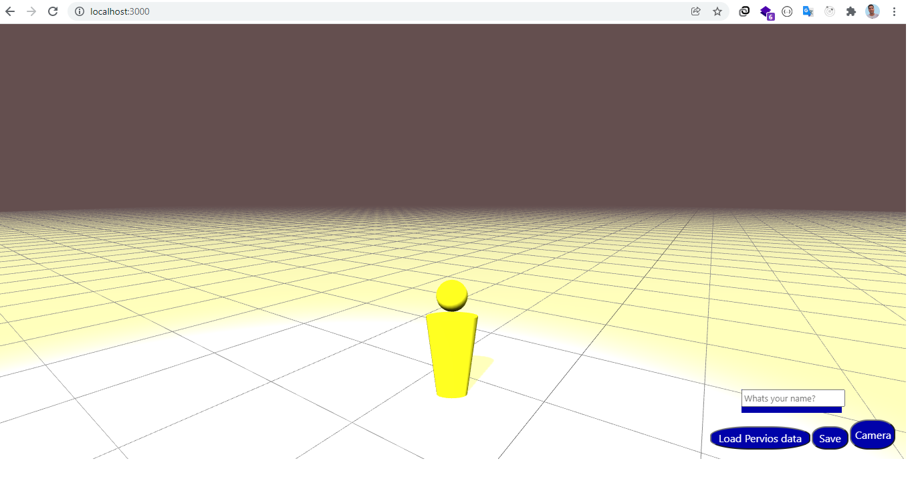

# Getting Start

There is a 3d character that could move around the scene in the project. position of the character could be save on Node js server in Mongodb if you enter the name of player and hit save button.

## Available Scripts

In the project directory, you can run:

### `npm run start`

Runs the app in the development mode.\
Open [http://localhost:3000](http://localhost:3000) to view it in your browser.

### `npm run backend`

Launches the backend on [http://localhost:8080](http://localhost:8080)
